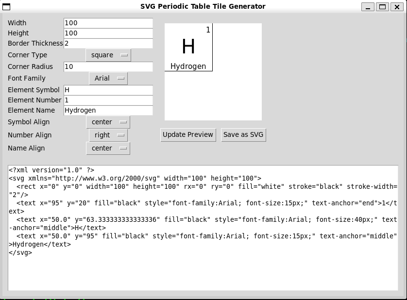
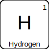

🧪 SVG Periodic Table Tile Generator
A Python GUI application for generating scalable vector graphic (SVG) tiles representing elements of the periodic table. Easily customize design parameters, preview your changes live, and export your tiles for educational use, poster design, or scientific visualization.

✨ Features
Real-Time Preview (Not Yet)
Live preview pane updates as you change any setting. 

Customizable Layout

Tile size: Width and height

Border thickness

Corner style: Square or Rounded with adjustable radius

Flexible Typography

Choose from common fonts: Arial, Verdana, Times New Roman, Courier New

Automatically scales font sizes to tile dimensions

Editable atomic number, element symbol, and name

Precise Text Alignment

Independent horizontal alignment (left, center, right) for:

Atomic number

Element symbol

Element name

Export Capabilities

Save your custom tile as an .svg file

🛠 Requirements
Install Python dependencies:

pip install pillow cairosvg
This uses:

tkinter for the GUI (included with most Python installations)

Pillow for image processing in the preview pane

CairoSVG for rendering SVG to PNG for preview

🚀 How to Run
bash
Copy
Edit
python svg_tile_generator.py
Replace svg_tile_generator.py with the actual filename of the script.

💾 Save Example
Once you customize the tile, click "Save as SVG" to export your design. You can open this SVG file in any vector graphics editor (like Inkscape or Adobe Illustrator) or embed it in web documents.

📸 Screenshots
Main Interface

📄 License
This project is licensed under the MIT License.
Feel free to use, modify, and share it.
